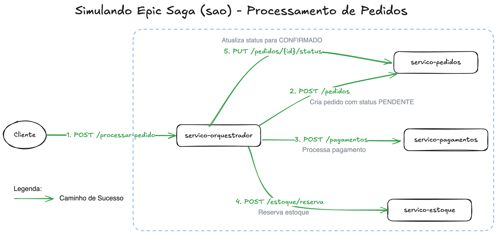

# THE EPIC SAGA!!!


<p>
  <a href="./LICENSE">
    
  </a>

  

  

  <a href="https://github.com/Duzim/epic-saga/commits/main">
    
  </a>
</p>

------
## Sobre o Projeto
Este é um projeto acadêmico que simula um processo de e-commerce utilizando a arquitetura de microsserviços e o padrão Saga (Orquestração). O objetivo é demonstrar como manter a consistência transacional entre diferentes serviços que não compartilham o mesmo banco de dados.

O projeto consiste em 4 serviços independentes (Node.js + Express) que se comunicam via HTTP:

+ **Orquestrador:** O cérebro da operação.

+ **Pedidos:** Gerencia a criação e o status dos pedidos.

+ **Pagamentos:** Processa e estorna pagamentos.

+ **Estoque:** Reserva e libera produtos do estoque.

Quando uma falha ocorre (ex: falta de estoque ou pagamento recusado), o Orquestrador é responsável por executar as transações de compensação (rollbacks) para reverter as operações já concluídas, garantindo que o sistema não fique em um estado inconsistente.

## Tecnologias Utilizadas
+ **Node.js:** Ambiente de execução.

+ **Express.js:** Framework para criação dos servidores e rotas.

+ **Axios:** Cliente HTTP para a comunicação síncrona entre os serviços.

+ **Zod:** Biblioteca para validação de schemas (contratos de API), garantindo que os dados de entrada estejam corretos.

## Estrutura dos Serviços
### 1 - Orquestrador
O serviço central que coordena a saga.
```
📦orchestrator
 ┣ 📂src
 ┃ ┣ 📂api
 ┃ ┃ ┗ 📜client.js
 ┃ ┣ 📂controllers
 ┃ ┃ ┗ 📜orchestrator.js
 ┃ ┣ 📂routes
 ┃ ┃ ┣ 📂middlewares
 ┃ ┃ ┃ ┗ 📜logs.js
 ┃ ┃ ┗ 📜routes.js
 ┃ ┣ 📂schemas
 ┃ ┃ ┗ 📜init-saga.schema.js
 ┃ ┗ 📂services
 ┃ ┃ ┗ 📜service.js
 ┣ 📜app.js
 ┣ 📜package-lock.json
 ┣ 📜package.json
 ┗ 📜server.js
```

### 2 - Pedidos
Gerencia o ciclo de vida dos pedidos.
```
📦orders
 ┣ 📂src
 ┃ ┣ 📂schemas
 ┃ ┃ ┗ 📜order.schema.js
 ┃ ┣ 📜controller.js
 ┃ ┣ 📜router.js
 ┃ ┗ 📜service.js
 ┣ 📜package-lock.json
 ┣ 📜package.json
 ┗ 📜server.js
```
### 3 - Pagamentos
Processa pagamentos e lida com reembolsos.
```
📦payments
 ┣ 📂src
 ┃ ┣ 📂schemas
 ┃ ┃ ┗ 📜order.schema.js
 ┃ ┣ 📜controller.js
 ┃ ┣ 📜router.js
 ┃ ┗ 📜service.js
 ┣ 📜package-lock.json
 ┣ 📜package.json
 ┗ 📜server.js
```

### 4 - Estoque
Controla a reserva e liberação de itens do inventário.
```
📦stock
 ┣ 📂src
 ┃ ┣ 📂schemas
 ┃ ┃ ┗ 📜stock.schema.js
 ┃ ┣ 📜controllers.js
 ┃ ┣ 📜router.js
 ┃ ┗ 📜services.js
 ┣ 📜package-lock.json
 ┣ 📜package.json
 ┗ 📜server.js
```
---

## 🚀 Como Executar o Projeto

Existem duas formas de iniciar o projeto: automatizada (recomendada) ou manual.

### 1. Execução Automatizada (com Shell Script)

Na raiz do projeto, há um script `start-services.sh` que automatiza todo o processo.

**O que o script faz:**
* Cria uma pasta `.logs` (se não existir).
* Verifica cada uma das 4 pastas de serviço.
* Se a pasta `node_modules` não existir, ele executa `npm install`.
* Inicia cada serviço em *background* (processo de fundo).
* Salva os logs de cada serviço em tempo real dentro da pasta `.logs` (ex: `.logs/orchestrator.log`).

**Para executar:**

1.  **Dê permissão de execução ao script** (só precisa fazer uma vez):
    ```bash
    chmod +x start-services.sh
    ```
2.  **Inicie o script:**
    ```bash
    ./start-services.sh
    ```
3.  **Para ver os logs** em tempo real:
    ```bash
    tail -f .logs/*.log
    ```
4.  **Para parar todos os serviços** de uma vez:
    ```bash
    killall node
    ```

### 2. Execução Manual

Você precisará de **4 terminais** abertos simultaneamente.

1.  **Instalar Dependências:** Antes de tudo, entre no diretório de **cada um dos 4 serviços** e rode o `npm install`:
    ```bash
    cd orchestrator
    npm install
    
    cd ../orders
    npm install
    
    # ... e assim por diante para 'payments' e 'stock'
    ```

2.  **Iniciar os Serviços:** Em cada um dos 4 terminais, inicie um serviço:

    * **Terminal 1 (Orquestrador):**
        ```bash
        cd orchestrator
        npm start
        # 🤖 Orchestrator Service rodando na porta 3000
        ```
    * **Terminal 2 (Pedidos):**
        ```bash
        cd orders
        npm start
        # 🛒 Orders Service rodando na porta 3001
        ```
    * **Terminal 3 (Pagamentos):**
        ```bash
        cd payments
        npm start
        # 💳 Payment Service rodando na porta 3002
        ```
    * **Terminal 4 (Estoque):**
        ```bash
        cd stock
        npm start
        # 📦 Stock Service rodando na porta 3003
        ```
3.  **Pronto!** O sistema está no ar e pronto para receber requisições no Orquestrador.

---